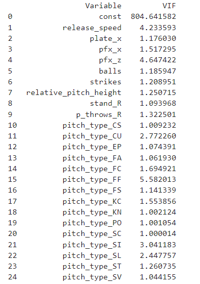
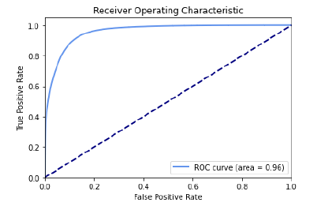

# Baseball Swing Probability Prediction

## Modeling Framework

1) **Model Choice and Framework**
   I decided to use **Random Forest Classifier** with **GridSearchCV** as my modeling framework, which involved extensive data processing and feature engineering.

   **a. Data Preprocessing**
      - **Training and Validation**: Used data from the first two seasons for training and validating the model with a train-validation split of 80-20%.
      - **Prediction**: Kept the data from season 3 specifically for predicting the final results.

   **b. Assumptions**
      - **Swing Event Classification**: Assumed the following events as swing events and assigned them a class of 1:
        ```python
        ['foul', 'hit_into_play', 'swinging_strike', 'foul_tip', 'foul_bunt', 
         'swinging_strike_blocked', 'missed_bunt', 'bunt_foul_tip','foul_pitchout']
        ```
      - **Handling Missing Data**: Removed rows with NaN values due to sufficient data availability. For season three predictions, assigned a swing probability of 0.5 to rows where data is missing.

   **c. Feature Engineering**
      - **Relative Pitch Height**: Created a new feature to account for the pitch’s vertical location relative to the batter's strike zone.
        ```python
        Relative pitch height = (plate_z - sz_bot) / (sz_top - sz_bot)
        ```
      - **One-hot Encoding**: Converted pitch type (a categorical feature) to one-hot encoding.
      - **Feature Set**: Considered the following features for my model:
        ```python
        ['release_speed', 'plate_x', 'stand', 'p_throws', 'pfx_x', 'pfx_z', 
         'balls', 'strikes', 'pitch_type', 'relative_pitch_height']
        ```

   **d. Multicollinearity Check**
      - Conducted statistical tests using the variance inflation factor (VIF) to check for multicollinearity amongst features. All VIF values were below or around 5, confirming distinct features with minimal inter-correlations.\
      


   **e. Modeling**
      - Employed Random Forest with GridSearchCV to optimize two hyperparameters: number of estimators (trees) and maximum depth of each tree. Considered values for number of estimators [50, 100, 200, 300] and for maximum depth [10, 15, 20, 25, 30], with the best results using 300 trees and a depth of 25.

   **f. Results**
      - **ROC AUC Score**: Achieved an ROC AUC Score of 0.96.
      - **Classification Report**: 
      
      - **Confusion Matrix**: 
      
      - **ROC Curve**: Emphasized the importance of more area under the curve as indicative of a better model.
                       

## Middle-Middle Pitches

### Define middle-middle pitches as being within 0.5 ft of the center of the strike zone. Variables from the model are most important in determining swing probability for middle-middle pitches? 

#### Answer
As seen from the figures below, **Relative Pitch Height** and **Strikes** are the two key features for determining swing probability for middle-middle pitches.

- **Relative Pitch Height**:  
  This metric indicates the vertical position of the pitch relative to each batter’s strike zone. It's a key determinant because a pitch that aligns well within the vertical mid-point of the strike zone is typically considered optimal for hitting due to its accessibility and potential for effective contact. Batters are likely to swing at these pitches as they are perceived to be in the 'sweet spot', making them easier to hit effectively.

- **Strikes**:  
  The count of strikes significantly influences a batter’s decision-making. With an increasing number of strikes, batters tend to swing more aggressively to avoid strikeouts, particularly in a two-strike situation. The urgency induced by a higher strike count forces batters to expand their strike zone, leading to more swings regardless of the pitch location.

The provided bar charts detail how swing decisions vary across different ball-strike combinations, highlighting changes in batting behavior under various count pressures. This information is invaluable for coaches, as it underscores the need for tailored training focusing on pitch recognition and strategic decision-making. By understanding and teaching how to interpret these key factors, coaches can effectively enhance a batter’s approach at the plate, particularly in high-pressure counts, improving their overall performance and on-base success.


## Swing Probability and Player Metrics

#### Answer
I have developed a metric called **Swing Efficiency Index (SEI)**, building on the concept of relative pitch height as previously explained. This metric combines each pitch’s relative pitch height with swing probability to account for the likelihood a batter would swing based on the pitch's position relative to their strike zone. 

**Methodology**:
- **Adjusted Swing Probability**: Calculate a combined product of each pitch’s relative pitch height and the swing probability. This accounts for the likelihood a batter will swing based on where the pitch is located relative to their strike zone.
- **Swing Efficiency Index (SEI)**: The SEI is calculated as the ratio of actual swing percentages to the adjusted swing probability. This index provides insights into how often a batter actually swings compared to how likely they are to swing at a pitch, reflecting the batter's mentality and execution.

This metric allows us to gauge the effectiveness and decision-making skills of batters in high-pressure situations and adjust training accordingly to enhance performance.
